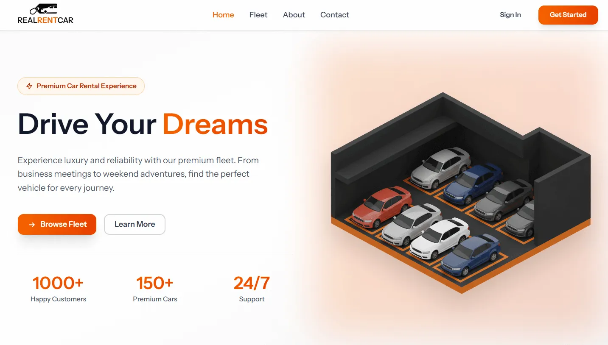
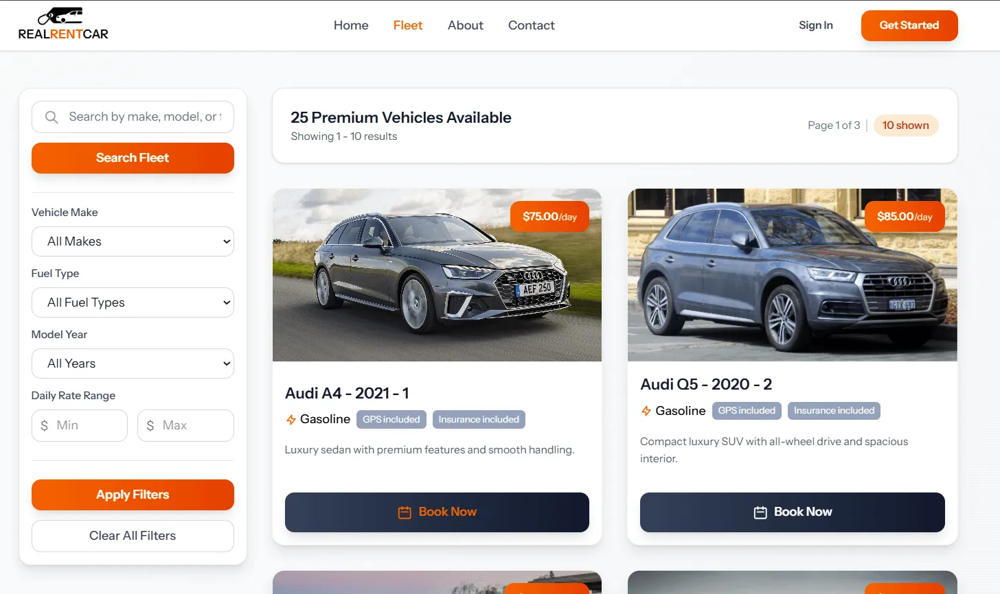
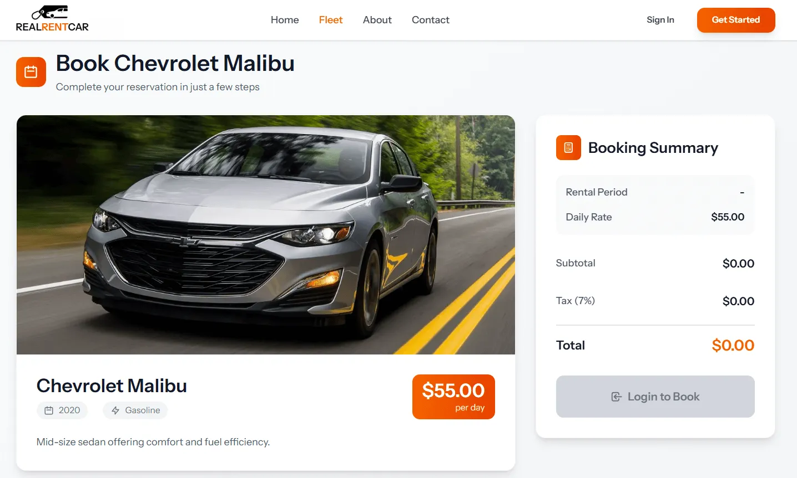
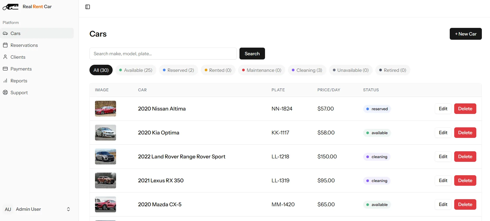
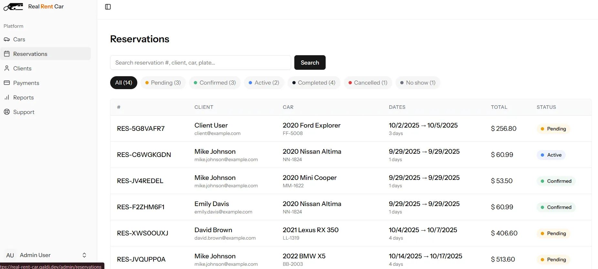
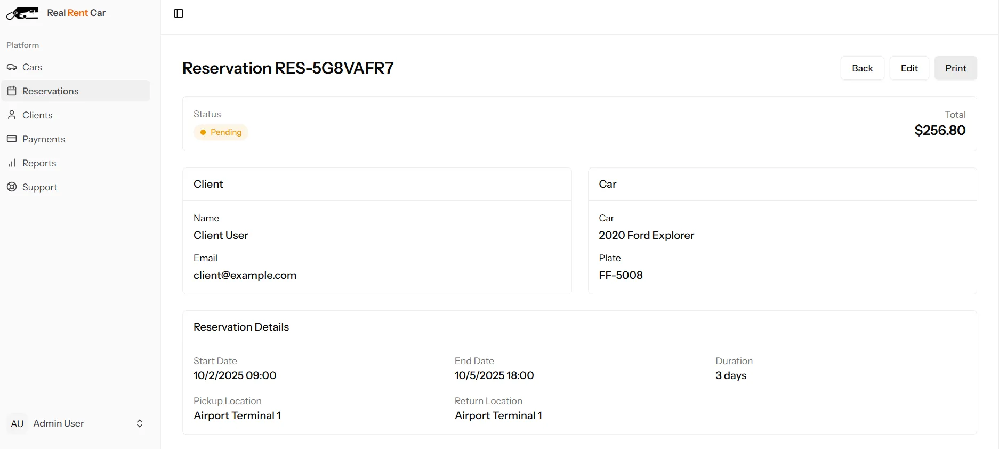

# Real Rent Car

> A modern, full-featured car rental management system built with Laravel, Inertia.js, and Vue.js

[](https://real-rent-car.galdi.dev/)
[](https://laravel.com)
[](https://vuejs.org)
[](LICENSE)
[](https://github.com/Mohamed-Galdi/real-rent-car/stargazers)


**[🌐 Visit Live Demo](https://real-rent-car.galdi.dev/)**

Real Rent Car is a comprehensive open-source car rental platform that streamlines vehicle reservations, fleet management, and customer interactions. This is a complete rebuild (v2) featuring modern technologies and an improved user experience.

---
## 🚀 Tech Stack

- **Backend:** Laravel 12
- **Frontend Framework:** Vue.js 3
- **Routing:** Inertia.js
- **Styling:** Tailwind CSS
- **Database:** MySQL/PostgreSQL compatible
- **Authentication:** Laravel Sanctum

---

## 📸 Screenshots

#### Home Page


#### Cars Page


#### Car Details Page


#### Admin Panel / Cars


#### Admin Panel / Reservations


#### Admin Panel / Reservation Details


## ✨ Features

### 🌍 Public Features
- **Vehicle Browsing** - Explore available vehicles with detailed specifications and high-quality images
- **Real-time Availability** - Check vehicle availability for specific dates
- **Online Reservations** - Seamless booking process with instant confirmation
- **Contact System** - Direct inquiry form for customer support
- **About Us** - Learn about the company and services
- **Fleet Showcase** - Comprehensive vehicle catalog with detailed specifications

### 👤 Client Portal
- **Secure Authentication** - User registration with email verification
- **Account Recovery** - Password reset functionality
- **Booking Management** - View complete booking history and details
- **Print Confirmations** - Generate printable booking receipts
- **Support Tickets** - Built-in ticketing system for customer support
- **Profile Management** - Update personal information and preferences
- **Two-Factor Authentication** - Enhanced security with 2FA
- **Customizable Interface** - Personalize appearance and settings

### 🔐 Admin Dashboard
- **Analytics Dashboard** - Overview of key metrics and insights
- **Vehicle Management** - Complete CRUD operations for fleet inventory
- **Reservation Control** - View, manage, and process all bookings
- **Client Administration** - Manage users (view, suspend, activate accounts)
- **Payment Tracking** - Monitor transactions and payment status
- **Reporting System** - Generate comprehensive business reports
- **Settings Panel** - Customize system-wide configurations
- **Support Management** - Handle and respond to customer tickets
- **Print Functions** - Export reservation details and reports

---

## 🔧 Installation

### Prerequisites
- PHP >= 8.2
- Composer
- Node.js >= 18.x
- MySQL/PostgreSQL

### Setup Instructions

```bash
# Clone the repository
git clone git@github.com:Mohamed-Galdi/real-rent-car.git
cd real-rent-car

# Install PHP dependencies
composer install

# Install Node dependencies
npm install

# Create environment file
cp .env.example .env

# Generate application key
php artisan key:generate

# Configure your database in .env file
# DB_DATABASE=your_database_name
# DB_USERNAME=your_username
# DB_PASSWORD=your_password

# Run database migrations
php artisan migrate

# Seed the database (optional)
php artisan db:seed

# Build frontend assets
npm run build

# Start the development server
php artisan serve
```

Visit `http://localhost:8000` to access the application.

### Development Mode

```bash
# Run frontend in development mode with hot reload
npm run dev

# In a separate terminal, start Laravel server
php artisan serve
```


## 🌿 Branches

- **`main`** → Laravel 12 + Inertia + Vue 3 + Tailwind (current, actively maintained)
- **`old`** → Laravel 10 + Bootstrap + jQuery (archived, kept for reference)

---

## 🤝 Contributing

Contributions are welcome! Please follow these steps:

1. Fork the repository
2. Create a feature branch (`git checkout -b feature/AmazingFeature`)
3. Commit your changes (`git commit -m 'Add some AmazingFeature'`)
4. Push to the branch (`git push origin feature/AmazingFeature`)
5. Open a Pull Request

Please ensure your code follows the project's coding standards and includes appropriate tests.

---

## 📝 License

This project is licensed under the MIT License - see the [LICENSE](LICENSE) file for details.

---

## 🐛 Bug Reports & Feature Requests

If you encounter any issues or have suggestions for improvements, please [open an issue](https://github.com/Mohamed-Galdi/real-rent-car/issues) on GitHub.

---

## 📧 Contact

For questions or support, please reach out through:
- GitHub Issues
- Contact form on the [live demo](https://real-rent-car.galdi.dev/)

---

## 🙏 Acknowledgments

Thanks to all contributors and the open-source community for making this project possible.

---

**[⭐ Star this repository](https://github.com/Mohamed-Galdi/real-rent-car)** if you find it helpful!

**[🌐 Try the Live Demo](https://real-rent-car.galdi.dev/)** to see it in action!